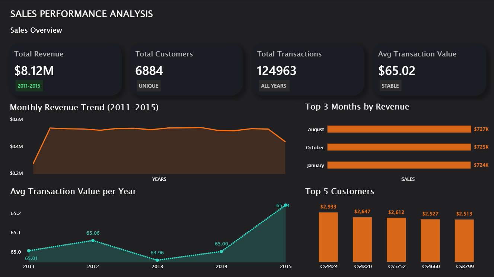

# sales-performance-analysis | Python + Power BI


---

## 📌 Project Overview

An end-to-end retail analytics project built on **125,000 transactions** across **6,884 customers** spanning 2011–2015. The project covers the full data analytics pipeline — from raw data cleaning in Python to an interactive Power BI dashboard with RFM segmentation and churn analysis.


---

## 📊 Dashboard Pages

### Page 1 — Sales Overview


| KPI | Value |
|-----|-------|
| Total Revenue | $8.12M |
| Total Transactions | 124,963 |
| Avg Transaction Value | $65.02 |
| Total Customers | 6,884 |

**Visuals:**
- Monthly Revenue Trend (2011–2015)
- Top 3 Months by Revenue (August, October, January)
- Avg Transaction Value Per Year (remarkably stable ~$65)
- Top 5 Customers by Spend

---

### Page 2 — RFM Segmentation & Churn Analysis


| KPI | Value |
|-----|-------|
| Premium Customers (P0) | 4,423 (64.3%) |
| At Risk Customers (P2) | 2,461 (35.7%) |
| Campaign Response Rate | 9.4% |
| Churn Risk | 90.6% |

**Visuals:**
- Customer Segments (RFM) — P0 Premium vs P2 At Risk
- Campaign Response / Churn Risk Donut Chart
- Avg Spend: Responders ($1,477) vs Non-Responders ($1,149)
- Customer Retention by Years Active
- Key Insights panel

---

## 🔑 Key Insights

- 📈 **64% of customers are Premium** — strong loyalty base with avg 21 orders and $1,469 spend
- 💸 **Responders spend 28% more** on average than non-responders ($1,477 vs $1,149)
- ⚠️ **90.6% churn risk** — only 647 out of 6,884 customers responded to campaigns
- 🔁 **56% of customers were active for all 5 years** — indicating strong long-term retention
- 📅 **Peak revenue year was 2013** ($2.13M), with a sharp drop in 2015 (partial year data)
- 🗓️ **August, October and January** are the highest revenue months

---

## 🛠️ Tech Stack

| Tool | Usage |
|------|-------|
| Python (Pandas, NumPy, Matplotlib, Seaborn) | Data cleaning, EDA, RFM analysis |
| Scipy | Outlier detection (Z-score) |
| Power BI | Dashboard development, DAX measures |
| DAX | KPI calculations, custom tables |
| Google Colab | Development environment |

---


---

## 🔄 Data Pipeline

```
Raw CSV Files
     ↓
Python (Colab) — Cleaning, Merging, EDA, RFM Segmentation
     ↓
Exported Summary CSVs
     ↓
Power BI — Data Model, DAX Measures, Dashboard
```

---

## 📐 RFM Segmentation Logic

Customers were segmented based on Recency, Frequency and Monetary values:

| Segment | Criteria | Count |
|---------|----------|-------|
| P0 — Premium | Recency ≥ 2012, Frequency ≥ 15, Monetary > $1,000 | 4,423 |
| P2 — At Risk | Does not meet Premium criteria | 2,461 |

---

## ⚙️ DAX Measures Used

```dax
Total Revenue = SUM(monthly_summary[total_revenue])
Total Transactions = SUM(monthly_summary[total_transactions])
Avg Transaction Value = AVERAGE(monthly_summary[avg_transaction])
Total Customers = DISTINCTCOUNT(customer_summary[customer_id])
Response Rate % = DIVIDE(COUNTROWS(FILTER(customer_summary, customer_summary[response] = 1)), COUNTROWS(customer_summary)) * 100
Premium Customers = COUNTROWS(FILTER(customer_summary, customer_summary[num_orders] >= 15 && customer_summary[total_spend] > 1000))
At Risk Customers = COUNTROWS(FILTER(customer_summary, customer_summary[num_orders] < 15 || customer_summary[total_spend] <= 1000))
```

---

## 👤 Author

**Kishunk Roushan**
B.Sc Computer Science & Data Analytics — IIT Patna (CGPA: 9.37)

[](https://linkedin.com/in/kishunk-roushan-b06079318)
[](https://github.com/kishunkroushan)
